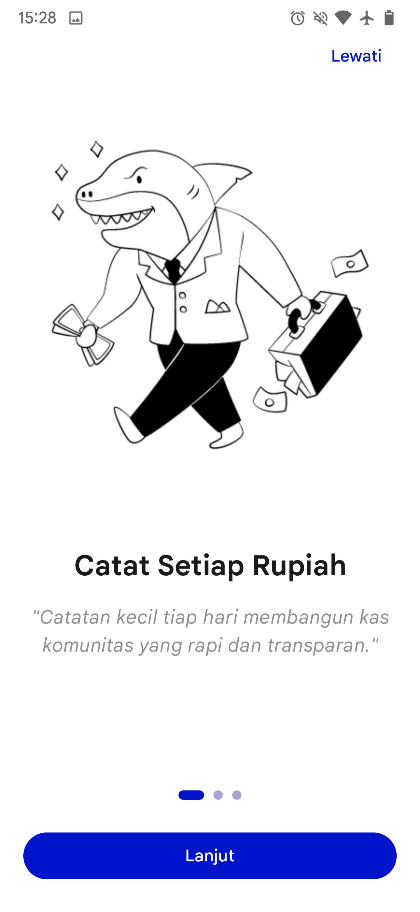
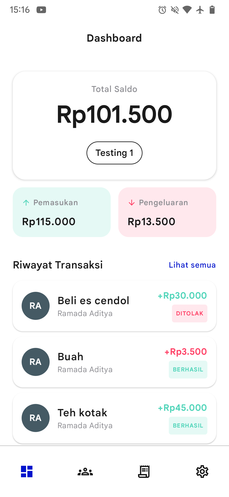
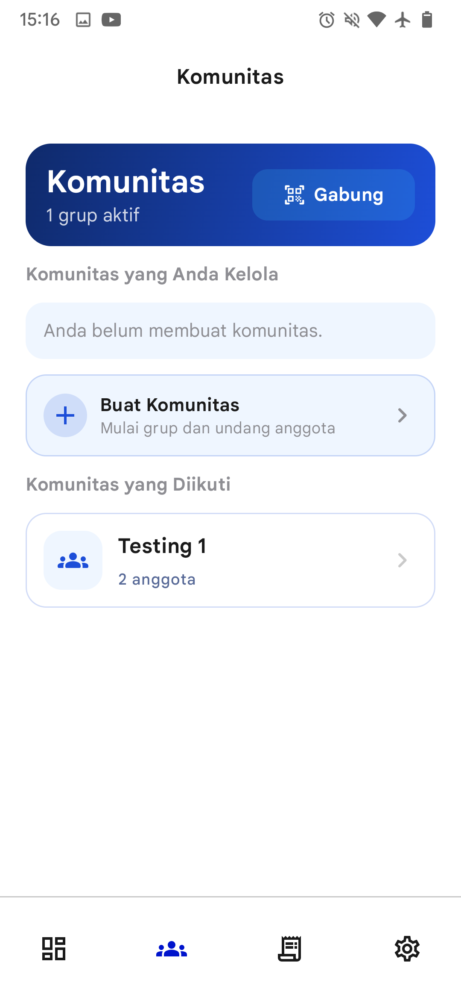
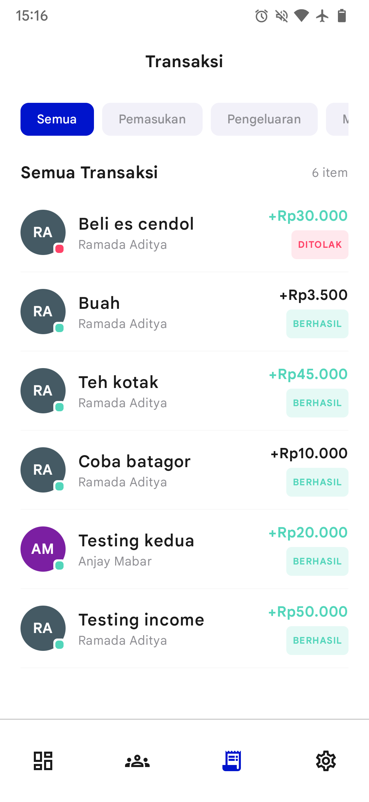
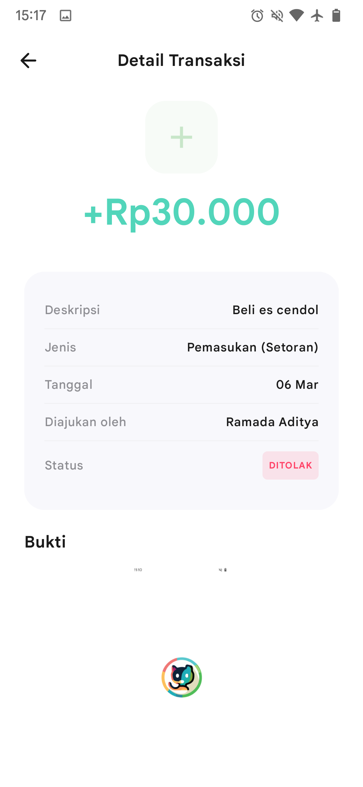
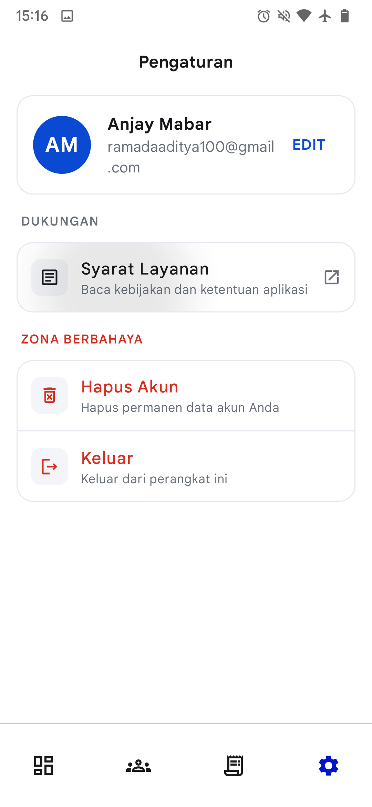

# KasKita

KasKita is an Android app for managing community cashflow ("kas"), built with modern Kotlin Android stack.

The app helps members and admins handle contributions and expenses in one place, with an offline-first data flow for smoother usage.

## Preview

> Replace these placeholders with your real app screenshots later.

| Onboarding | Dashboard |
|---|---|
|  |  |

| Community | Transactions |
|---|---|
|  |  |

| Transaction Detail | Settings |
|---|---|
|  |  |

When you are ready, put screenshots in `docs/screenshots/` and update the image links.

## Key Features

- Email authentication with Supabase Auth
- Onboarding flow on first launch
- Community management: create and join community via code
- Community member listing and role-based admin checks
- Transaction flow: submit, view history, and approve/reject (admin)
- Offline-first repository with Room cache + periodic sync policy
- Modern Jetpack Compose UI with Navigation Compose

## Tech Stack

- **Language:** Kotlin
- **UI:** Jetpack Compose + Material 3
- **Architecture:** Clean-ish layered approach (`presentation`, `domain`, `data`)
- **Dependency Injection:** Hilt
- **Remote Backend:** Supabase (Auth, PostgREST, RPC)
- **Local Storage:** Room
- **Networking:** Ktor (via Supabase Kotlin SDK)
- **Image Loading:** Coil
- **Analytics:** Firebase Analytics

## Project Structure

```text
app/src/main/java/com/ramstudio/kaskita
├── core        # navigation, DI, utils
├── data        # datasource, repository, local db, sync policy
├── domain      # models + repository interfaces
├── presentation# screens + viewmodels
└── ui          # app scaffold + theme
```

## Database Context

The app integrates with a Supabase schema centered around:

- `communities`
- `community_members`
- `profiles`
- `transactions`

With RPC usage for key operations such as:

- `create_community_with_admin`
- `join_community_by_code`
- `approve_transaction`
- `reject_transaction`

## Getting Started

### Prerequisites

- Android Studio (latest stable recommended)
- JDK 21
- Android SDK with `minSdk 24`
- Supabase project credentials

### Local Setup

1. Clone this repository.
2. Open with Android Studio.
3. Add your Supabase credentials to `local.properties`:

```properties
PROJECT_URL=your_supabase_project_url
ANON_KEY=your_supabase_anon_key
```

4. Build and run:

```bash
./gradlew :app:assembleDebug
```

## Status

This project is actively developed. Core flows are implemented and can be expanded with stronger testing, CI, and release automation.

## Author

**Rama Studio**  
Android Developer
